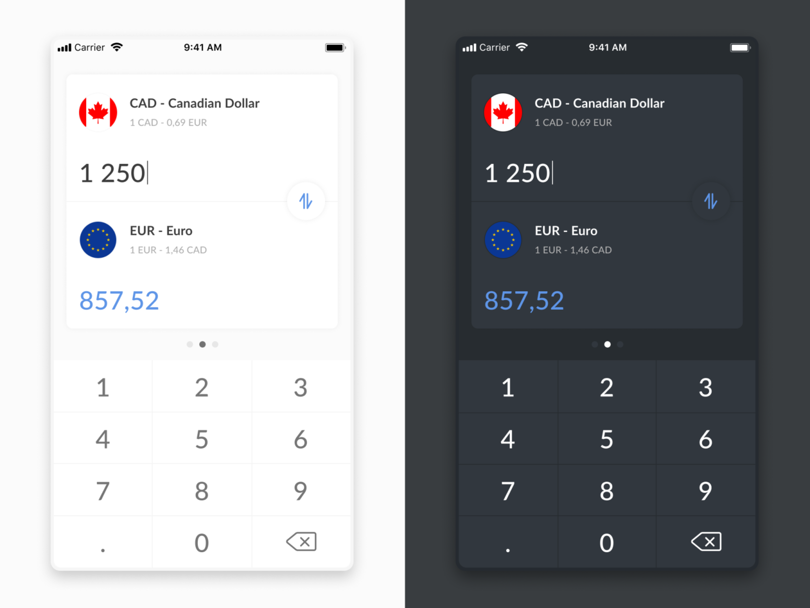

# WIP (work in progress)

Design by [Kirill](https://dribbble.com/kirillix).

## TODO
- [ ] Improvement UI design
- [ ] Implement night theme
- [x] Swap currencies
- [x] Make currencies selectable for user
- [ ] Fully replace LiveData with Flow(kotlinx.coroutines)
- [ ] Improve keyboard design.

## Used libraries
- Glide - for image loading
- Toothpick - DI container.
- Gson - JSON converter
- OkHttp - network requests.
